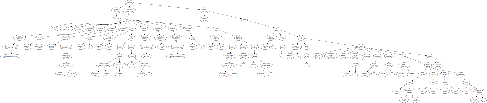
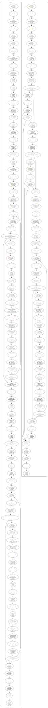
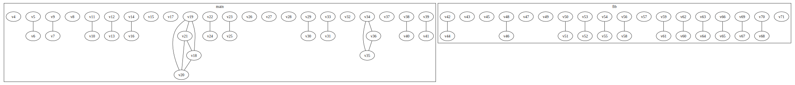

# C subset Compiler

For my Compiler Design class, I wrote a complete compiler for a subset of the C programming language from scratch in Java. This included the compiler front-end that was written by hand, as well as the back-end with the code generator and a graph colouring register allocator. The final version of the compiler also had support for some object-oriented programming features, such as inheritance and polymorphism. At 10860 lines of code, this was by far the largest solo project I've worked on!

I cannot share the repository for this project so instead I made this readme showing some of the compiler's inner workings.

## Input program
The compiled language is essentially a simpler version of C, with some differences in the semantics and typing rules. I will use the following program as an example input program to the compiler:
```c
int fib(int n);

void main() {
    int n;
    int *result;
    int i;

    print_s((char*) "How many to calculate? ");
    n = read_i();

    result = (int *) mcmalloc(sizeof(int) * n);

    i = 0;
    while (i < n) {
        result[i] = fib(i);
        i = i + 1;
    }

    print_s((char*) "The first ");
    print_i(n);
    print_s((char*) " Fibonacci numbers are: ");

    i = 0;
    while (i < n) {
        print_i(result[i]);
        print_c(' ');
        i = i + 1;
    }
}

int fib(int n) {
    if (n == 0) {
        return 0;
    } else if (n == 1) {
        return 1;
    } else {
        int first;
        int second;
        int i;
        int next;

        first = 0;
        second = 1;
        i = 2;
        while (i <= n) {
            next = first + second;
            first = second;
            second = next;
            i = i + 1;
        }

        return second;
    }
}
```

## Outputs
Below are the outputs of different parts of the compiler using the above program as input. This shows a bit of how the compiler understands and processes the program!

<details open>
  <summary>Lexer</summary>
  The lexer analyzes the stream of characters and converts them into tokens, if possible, or outputs an error if an illegal character appears in the input. 

  Output:
  ```
INT[1:1]
IDENTIFIER(fib)[1:5]
LPAR[1:8]
INT[1:9]
IDENTIFIER(n)[1:13]
RPAR[1:14]
SC[1:15]
VOID[3:1]
IDENTIFIER(main)[3:6]
LPAR[3:10]
RPAR[3:11]
LBRA[3:13]
INT[4:5]
IDENTIFIER(n)[4:9]
SC[4:10]
INT[5:5]
ASTERISK[5:9]
IDENTIFIER(result)[5:10]
SC[5:16]
INT[6:5]
IDENTIFIER(i)[6:9]
SC[6:10]
IDENTIFIER(print_s)[8:5]
LPAR[8:12]
LPAR[8:13]
CHAR[8:14]
ASTERISK[8:18]
RPAR[8:19]
STRING_LITERAL(How many to calculate? )[8:21]
RPAR[8:46]
SC[8:47]
IDENTIFIER(n)[9:5]
ASSIGN[9:7]
IDENTIFIER(read_i)[9:9]
LPAR[9:15]
RPAR[9:16]
SC[9:17]
IDENTIFIER(result)[11:5]
ASSIGN[11:12]
LPAR[11:14]
INT[11:15]
ASTERISK[11:19]
RPAR[11:20]
IDENTIFIER(mcmalloc)[11:22]
LPAR[11:30]
SIZEOF[11:31]
LPAR[11:37]
INT[11:38]
RPAR[11:41]
ASTERISK[11:43]
IDENTIFIER(n)[11:45]
RPAR[11:46]
SC[11:47]
IDENTIFIER(i)[13:5]
ASSIGN[13:7]
INT_LITERAL(0)[13:9]
SC[13:10]
WHILE[14:5]
LPAR[14:11]
IDENTIFIER(i)[14:12]
LT[14:14]
IDENTIFIER(n)[14:16]
RPAR[14:17]
LBRA[14:19]
IDENTIFIER(result)[15:9]
LSBR[15:15]
IDENTIFIER(i)[15:16]
RSBR[15:17]
ASSIGN[15:19]
IDENTIFIER(fib)[15:21]
LPAR[15:24]
IDENTIFIER(i)[15:25]
RPAR[15:26]
SC[15:27]
IDENTIFIER(i)[16:9]
ASSIGN[16:11]
IDENTIFIER(i)[16:13]
PLUS[16:15]
INT_LITERAL(1)[16:17]
SC[16:18]
RBRA[17:5]
IDENTIFIER(print_s)[19:5]
LPAR[19:12]
LPAR[19:13]
CHAR[19:14]
ASTERISK[19:18]
RPAR[19:19]
STRING_LITERAL(The first )[19:21]
RPAR[19:33]
SC[19:34]
IDENTIFIER(print_i)[20:5]
LPAR[20:12]
IDENTIFIER(n)[20:13]
RPAR[20:14]
SC[20:15]
IDENTIFIER(print_s)[21:5]
LPAR[21:12]
LPAR[21:13]
CHAR[21:14]
ASTERISK[21:18]
RPAR[21:19]
STRING_LITERAL( Fibonacci numbers are: )[21:21]
RPAR[21:47]
SC[21:48]
IDENTIFIER(i)[23:5]
ASSIGN[23:7]
INT_LITERAL(0)[23:9]
SC[23:10]
WHILE[24:5]
LPAR[24:11]
IDENTIFIER(i)[24:12]
LT[24:14]
IDENTIFIER(n)[24:16]
RPAR[24:17]
LBRA[24:19]
IDENTIFIER(print_i)[25:9]
LPAR[25:16]
IDENTIFIER(result)[25:17]
LSBR[25:23]
IDENTIFIER(i)[25:24]
RSBR[25:25]
RPAR[25:26]
SC[25:27]
IDENTIFIER(print_c)[26:9]
LPAR[26:16]
CHAR_LITERAL( )[26:17]
RPAR[26:20]
SC[26:21]
IDENTIFIER(i)[27:9]
ASSIGN[27:11]
IDENTIFIER(i)[27:13]
PLUS[27:15]
INT_LITERAL(1)[27:17]
SC[27:18]
RBRA[28:5]
RBRA[29:1]
INT[31:1]
IDENTIFIER(fib)[31:5]
LPAR[31:8]
INT[31:9]
IDENTIFIER(n)[31:13]
RPAR[31:14]
LBRA[31:16]
IF[32:5]
LPAR[32:8]
IDENTIFIER(n)[32:9]
EQ[32:11]
INT_LITERAL(0)[32:14]
RPAR[32:15]
LBRA[32:17]
RETURN[33:9]
INT_LITERAL(0)[33:16]
SC[33:17]
RBRA[34:5]
ELSE[34:7]
IF[34:12]
LPAR[34:15]
IDENTIFIER(n)[34:16]
EQ[34:18]
INT_LITERAL(1)[34:21]
RPAR[34:22]
LBRA[34:24]
RETURN[35:9]
INT_LITERAL(1)[35:16]
SC[35:17]
RBRA[36:5]
ELSE[36:7]
LBRA[36:12]
INT[37:9]
IDENTIFIER(first)[37:13]
SC[37:18]
INT[38:9]
IDENTIFIER(second)[38:13]
SC[38:19]
INT[39:9]
IDENTIFIER(i)[39:13]
SC[39:14]
INT[40:9]
IDENTIFIER(next)[40:13]
SC[40:17]
IDENTIFIER(first)[42:9]
ASSIGN[42:15]
INT_LITERAL(0)[42:17]
SC[42:18]
IDENTIFIER(second)[43:9]
ASSIGN[43:16]
INT_LITERAL(1)[43:18]
SC[43:19]
IDENTIFIER(i)[44:9]
ASSIGN[44:11]
INT_LITERAL(2)[44:13]
SC[44:14]
WHILE[45:9]
LPAR[45:15]
IDENTIFIER(i)[45:16]
LE[45:18]
IDENTIFIER(n)[45:21]
RPAR[45:22]
LBRA[45:24]
IDENTIFIER(next)[46:13]
ASSIGN[46:18]
IDENTIFIER(first)[46:20]
PLUS[46:26]
IDENTIFIER(second)[46:28]
SC[46:34]
IDENTIFIER(first)[47:13]
ASSIGN[47:19]
IDENTIFIER(second)[47:21]
SC[47:27]
IDENTIFIER(second)[48:13]
ASSIGN[48:20]
IDENTIFIER(next)[48:22]
SC[48:26]
IDENTIFIER(i)[49:13]
ASSIGN[49:15]
IDENTIFIER(i)[49:17]
PLUS[49:19]
INT_LITERAL(1)[49:21]
SC[49:22]
RBRA[50:9]
RETURN[52:9]
IDENTIFIER(second)[52:16]
SC[52:22]
RBRA[53:5]
RBRA[54:1]
Lexing: pass
  ```
</details>

<details open>
  <summary>Parser/AST</summary>
  The parser does two things: it checks that the stream of tokens respects the language's grammar, and creates an Abstract Syntax Tree. The compiler can output the AST both as a textual representation (useful for testing, not so much for visualizing), and as a GraphViz DOT file which can be used to create a visual graph.

  Outputs:
  ```
Program(FunProto(INT,fib,VarDecl(INT,n)),FunDecl(VOID,main,Block(VarDecl(INT,n),VarDecl(PointerType(INT),result),VarDecl(INT,i),ExprStmt(FunCallExpr(print_s,TypecastExpr(PointerType(CHAR),StrLiteral(How many to calculate? )))),ExprStmt(Assign(VarExpr(n),FunCallExpr(read_i))),ExprStmt(Assign(VarExpr(result),TypecastExpr(PointerType(INT),FunCallExpr(mcmalloc,BinOp(SizeOfExpr(INT),MUL,VarExpr(n)))))),ExprStmt(Assign(VarExpr(i),IntLiteral(0))),While(BinOp(VarExpr(i),LT,VarExpr(n)),Block(ExprStmt(Assign(ArrayAccessExpr(VarExpr(result),VarExpr(i)),FunCallExpr(fib,VarExpr(i)))),ExprStmt(Assign(VarExpr(i),BinOp(VarExpr(i),ADD,IntLiteral(1)))))),ExprStmt(FunCallExpr(print_s,TypecastExpr(PointerType(CHAR),StrLiteral(The first )))),ExprStmt(FunCallExpr(print_i,VarExpr(n))),ExprStmt(FunCallExpr(print_s,TypecastExpr(PointerType(CHAR),StrLiteral( Fibonacci numbers are: )))),ExprStmt(Assign(VarExpr(i),IntLiteral(0))),While(BinOp(VarExpr(i),LT,VarExpr(n)),Block(ExprStmt(FunCallExpr(print_i,ArrayAccessExpr(VarExpr(result),VarExpr(i)))),ExprStmt(FunCallExpr(print_c,ChrLiteral( ))),ExprStmt(Assign(VarExpr(i),BinOp(VarExpr(i),ADD,IntLiteral(1)))))))),FunDecl(INT,fib,VarDecl(INT,n),Block(If(BinOp(VarExpr(n),EQ,IntLiteral(0)),Block(Return(IntLiteral(0))),If(BinOp(VarExpr(n),EQ,IntLiteral(1)),Block(Return(IntLiteral(1))),Block(VarDecl(INT,first),VarDecl(INT,second),VarDecl(INT,i),VarDecl(INT,next),ExprStmt(Assign(VarExpr(first),IntLiteral(0))),ExprStmt(Assign(VarExpr(second),IntLiteral(1))),ExprStmt(Assign(VarExpr(i),IntLiteral(2))),While(BinOp(VarExpr(i),LE,VarExpr(n)),Block(ExprStmt(Assign(VarExpr(next),BinOp(VarExpr(first),ADD,VarExpr(second)))),ExprStmt(Assign(VarExpr(first),VarExpr(second))),ExprStmt(Assign(VarExpr(second),VarExpr(next))),ExprStmt(Assign(VarExpr(i),BinOp(VarExpr(i),ADD,IntLiteral(1)))))),Return(VarExpr(second))))))))
  ```


</details>

<details open>
  <summary>Code Generation</summary>
  Once the AST is done and the semantic analyzer has validated it, the code generator will go recursively through the graph and emit assembly instructions to compute the necessary values. The output is an assembly program (MIPS assembly in this case) with virtual registers.

Output
  ```
.data
# ====================Function Start: main====================

.data
label_0_StrLiteral:
.asciiz "How many to calculate? "
label_1_StrLiteral:
.asciiz "The first "
label_2_StrLiteral:
.asciiz " Fibonacci numbers are: "

.text
main:
.globl main
# Prologue:
addi $sp,$sp,-4
sw $fp,0($sp)
movz $fp,$sp,$zero
addi $sp,$sp,-4
sw $ra,0($sp)
addi $sp,$sp,-12
pushRegisters
# Function body:
# Calling function print_s
la v4,label_0_StrLiteral
li $v0,4
movz $a0,v4,$zero
syscall
# Calling function read_i
li $v0,5
syscall
movz v5,$v0,$zero
addi v6,$fp,-8
sw v5,0(v6)
# Calling function mcmalloc
li v7,4
lw v9,-8($fp)
mul v8,v7,v9
li $v0,9
movz $a0,v8,$zero
syscall
movz v10,$v0,$zero
addi v11,$fp,-12
sw v10,0(v11)
li v12,0
addi v13,$fp,-16
sw v12,0(v13)
# While: pre-test
label_4_whilePretest:
lw v14,-16($fp)
lw v16,-8($fp)
slt v15,v14,v16
beq v15,$zero,label_5_endWhile
# While: loop body
# Calling function fib
addi $sp,$sp,-4
lw v17,-16($fp)
sw v17,0($sp)
addi $sp,$sp,-4
jal fib
lw v18,0($sp)
addi $sp,$sp,8
lw v20,-12($fp)
lw v21,-16($fp)
li v19,4
mul v19,v21,v19
add v19,v20,v19
sw v18,0(v19)
lw v22,-16($fp)
li v24,1
add v23,v22,v24
addi v25,$fp,-16
sw v23,0(v25)
j label_4_whilePretest
label_5_endWhile:
# Calling function print_s
la v26,label_1_StrLiteral
li $v0,4
movz $a0,v26,$zero
syscall
# Calling function print_i
lw v27,-8($fp)
li $v0,1
movz $a0,v27,$zero
syscall
# Calling function print_s
la v28,label_2_StrLiteral
li $v0,4
movz $a0,v28,$zero
syscall
li v29,0
addi v30,$fp,-16
sw v29,0(v30)
# While: pre-test
label_7_whilePretest:
lw v31,-16($fp)
lw v33,-8($fp)
slt v32,v31,v33
beq v32,$zero,label_8_endWhile
# While: loop body
# Calling function print_i
lw v35,-12($fp)
lw v36,-16($fp)
li v34,4
mul v34,v36,v34
add v35,v35,v34
lw v34,0(v35)
li $v0,1
movz $a0,v34,$zero
syscall
# Calling function print_c
li v37,32
li $v0,11
movz $a0,v37,$zero
syscall
lw v38,-16($fp)
li v40,1
add v39,v38,v40
addi v41,$fp,-16
sw v39,0(v41)
j label_7_whilePretest
label_8_endWhile:
# Epilogue:
main_epilogue:
popRegisters
addi $sp,$fp,4
lw $ra,-4($fp)
lw $fp,0($fp)
li $v0,10
syscall
# ====================Function End: main====================
# ====================Function Start: fib====================

.data

.text
fib:
# Prologue:
addi $sp,$sp,-4
sw $fp,0($sp)
movz $fp,$sp,$zero
addi $sp,$sp,-4
sw $ra,0($sp)
addi $sp,$sp,-16
pushRegisters
# Function body:
# If: checking condition
lw v42,8($fp)
li v44,0
xor v43,v42,v44
sltiu v43,v43,1
beq v43,$zero,label_10_else
# If: if branch
li v45,0
sw v45,4($fp)
j fib_epilogue
j label_11_end
# If: else branch
label_10_else:
# If: checking condition
lw v46,8($fp)
li v48,1
xor v47,v46,v48
sltiu v47,v47,1
beq v47,$zero,label_13_else
# If: if branch
li v49,1
sw v49,4($fp)
j fib_epilogue
j label_14_end
# If: else branch
label_13_else:
li v50,0
addi v51,$fp,-8
sw v50,0(v51)
li v52,1
addi v53,$fp,-12
sw v52,0(v53)
li v54,2
addi v55,$fp,-16
sw v54,0(v55)
# While: pre-test
label_15_whilePretest:
lw v56,-16($fp)
lw v58,8($fp)
slt v57,v58,v56
xori v57,v57,1
beq v57,$zero,label_16_endWhile
# While: loop body
lw v59,-8($fp)
lw v61,-12($fp)
add v60,v59,v61
addi v62,$fp,-20
sw v60,0(v62)
lw v63,-12($fp)
addi v64,$fp,-8
sw v63,0(v64)
lw v65,-20($fp)
addi v66,$fp,-12
sw v65,0(v66)
lw v67,-16($fp)
li v69,1
add v68,v67,v69
addi v70,$fp,-16
sw v68,0(v70)
j label_15_whilePretest
label_16_endWhile:
lw v71,-12($fp)
sw v71,4($fp)
j fib_epilogue
label_14_end:
label_11_end:
# Epilogue:
fib_epilogue:
popRegisters
addi $sp,$fp,4
lw $ra,-4($fp)
lw $fp,0($fp)
jr $ra
# ====================Function End: fib====================
  ```
</details>

<details open>
  <summary>Register Allocation</summary>
  Of course, virtual registers can't be used on a CPU, so we need a register allocator to map the virtual registers to physical ones. For this, the assembly program is first analyzed into a control-flow graph. This graph represents the possible paths of execution of the program, and is used by the liveness analyzer to create an interference graph. The latter is then used in Chaitin's Algorithm to map the registers, giving us the final assembly program!

  Outputs
  <details>
    <summary>Control-flow graph</summary>
    
  </details>
  
  Interference graph:
  

  Final assembly:
  ```
.data
# ====================Function Start: main====================

.data
label_0_StrLiteral:
.asciiz "How many to calculate? "
label_1_StrLiteral:
.asciiz "The first "
label_2_StrLiteral:
.asciiz " Fibonacci numbers are: "

.text
main:
.globl main
# Prologue:
addi $sp,$sp,-4
sw $fp,0($sp)
movz $fp,$sp,$zero
addi $sp,$sp,-4
sw $ra,0($sp)
addi $sp,$sp,-12
# pushRegisters
addi $sp,$sp,-16
sw $t0,0($sp)
sw $t1,4($sp)
sw $t3,8($sp)
sw $t2,12($sp)
# Function body:
# Calling function print_s
la $t0,label_0_StrLiteral
li $v0,4
movz $a0,$t0,$zero
syscall
# Calling function read_i
li $v0,5
syscall
movz $t0,$v0,$zero
addi $t1,$fp,-8
sw $t0,0($t1)
# Calling function mcmalloc
li $t0,4
lw $t1,-8($fp)
mul $t0,$t0,$t1
li $v0,9
movz $a0,$t0,$zero
syscall
movz $t1,$v0,$zero
addi $t0,$fp,-12
sw $t1,0($t0)
li $t0,0
addi $t1,$fp,-16
sw $t0,0($t1)
# While: pre-test
label_4_whilePretest:
lw $t1,-16($fp)
lw $t0,-8($fp)
slt $t0,$t1,$t0
beq $t0,$zero,label_5_endWhile
# While: loop body
# Calling function fib
addi $sp,$sp,-4
lw $t0,-16($fp)
sw $t0,0($sp)
addi $sp,$sp,-4
jal fib
lw $t0,0($sp)
addi $sp,$sp,8
lw $t3,-12($fp)
lw $t1,-16($fp)
li $t2,4
mul $t2,$t1,$t2
add $t2,$t3,$t2
sw $t0,0($t2)
lw $t1,-16($fp)
li $t0,1
add $t0,$t1,$t0
addi $t1,$fp,-16
sw $t0,0($t1)
j label_4_whilePretest
label_5_endWhile:
# Calling function print_s
la $t0,label_1_StrLiteral
li $v0,4
movz $a0,$t0,$zero
syscall
# Calling function print_i
lw $t0,-8($fp)
li $v0,1
movz $a0,$t0,$zero
syscall
# Calling function print_s
la $t0,label_2_StrLiteral
li $v0,4
movz $a0,$t0,$zero
syscall
li $t0,0
addi $t1,$fp,-16
sw $t0,0($t1)
# While: pre-test
label_7_whilePretest:
lw $t1,-16($fp)
lw $t0,-8($fp)
slt $t0,$t1,$t0
beq $t0,$zero,label_8_endWhile
# While: loop body
# Calling function print_i
lw $t1,-12($fp)
lw $t0,-16($fp)
li $t2,4
mul $t2,$t0,$t2
add $t1,$t1,$t2
lw $t2,0($t1)
li $v0,1
movz $a0,$t2,$zero
syscall
# Calling function print_c
li $t0,32
li $v0,11
movz $a0,$t0,$zero
syscall
lw $t1,-16($fp)
li $t0,1
add $t1,$t1,$t0
addi $t0,$fp,-16
sw $t1,0($t0)
j label_7_whilePretest
label_8_endWhile:
# Epilogue:
main_epilogue:
# popRegisters
lw $t0,0($sp)
lw $t1,4($sp)
lw $t3,8($sp)
lw $t2,12($sp)
addi $sp,$sp,16
addi $sp,$fp,4
lw $ra,-4($fp)
lw $fp,0($fp)
li $v0,10
syscall
# ====================Function End: main====================
# ====================Function Start: fib====================

.data

.text
fib:
# Prologue:
addi $sp,$sp,-4
sw $fp,0($sp)
movz $fp,$sp,$zero
addi $sp,$sp,-4
sw $ra,0($sp)
addi $sp,$sp,-16
# pushRegisters
addi $sp,$sp,-8
sw $t0,0($sp)
sw $t1,4($sp)
# Function body:
# If: checking condition
lw $t1,8($fp)
li $t0,0
xor $t0,$t1,$t0
sltiu $t0,$t0,1
beq $t0,$zero,label_10_else
# If: if branch
li $t0,0
sw $t0,4($fp)
j fib_epilogue
j label_11_end
# If: else branch
label_10_else:
# If: checking condition
lw $t1,8($fp)
li $t0,1
xor $t0,$t1,$t0
sltiu $t0,$t0,1
beq $t0,$zero,label_13_else
# If: if branch
li $t0,1
sw $t0,4($fp)
j fib_epilogue
j label_14_end
# If: else branch
label_13_else:
li $t0,0
addi $t1,$fp,-8
sw $t0,0($t1)
li $t0,1
addi $t1,$fp,-12
sw $t0,0($t1)
li $t1,2
addi $t0,$fp,-16
sw $t1,0($t0)
# While: pre-test
label_15_whilePretest:
lw $t1,-16($fp)
lw $t0,8($fp)
slt $t0,$t0,$t1
xori $t0,$t0,1
beq $t0,$zero,label_16_endWhile
# While: loop body
lw $t1,-8($fp)
lw $t0,-12($fp)
add $t0,$t1,$t0
addi $t1,$fp,-20
sw $t0,0($t1)
lw $t0,-12($fp)
addi $t1,$fp,-8
sw $t0,0($t1)
lw $t1,-20($fp)
addi $t0,$fp,-12
sw $t1,0($t0)
lw $t0,-16($fp)
li $t1,1
add $t1,$t0,$t1
addi $t0,$fp,-16
sw $t1,0($t0)
j label_15_whilePretest
label_16_endWhile:
lw $t0,-12($fp)
sw $t0,4($fp)
j fib_epilogue
label_14_end:
label_11_end:
# Epilogue:
fib_epilogue:
# popRegisters
lw $t0,0($sp)
lw $t1,4($sp)
addi $sp,$sp,8
addi $sp,$fp,4
lw $ra,-4($fp)
lw $fp,0($fp)
jr $ra
# ====================Function End: fib====================
  ```
</details>

### Final output
Using the [MARS MIPS simulator](https://courses.missouristate.edu/KenVollmar/mars/tutorial.htm), we can now run the final program and get the expected output:
```
How many to calculate? 20
The first 20 Fibonacci numbers are: 0 1 1 2 3 5 8 13 21 34 55 89 144 233 377 610 987 1597 2584 4181
```

## Object-oriented features
The following program uses some of the basic object-oriented features available:
```c
class Counter {
  int value;

  void increment() {
    value = value + 1;
  }

  void decrement() {
    value = value - 1;
  }
}

class Counter2 extends Counter {
  void increment() {
    value = value + 2;
  }
}

void main() {
  class Counter c1;
  class Counter c2;

  c1 = new class Counter();
  c2 = (class Counter) new class Counter2();

  c1.value = 0;
  c2.value = 0;

  print_s((char *) "c1 and c2 initial values: ");
  print_i(c1.value);
  print_c(' ');
  print_i(c2.value);

  c1.increment();
  c2.increment();

  print_s((char *) "\nc1 and c2 after increment: ");
  print_i(c1.value);
  print_c(' ');
  print_i(c2.value);

  c1.decrement();
  c2.decrement();

  print_s((char *) "\nc1 and c2 after decrement: ");
  print_i(c1.value);
  print_c(' ');
  print_i(c2.value);
}
```

For the above program, the produced assembly is below. Notably, the first lines show the virtual tables for the classes, which determine which version of the overridden methods are to be used with which combination of static type and runtime type.

```
.data
label_0_Counter_vtable:
.word label_1_Counter_increment
.word label_2_Counter_decrement
label_3_Counter2_vtable:
.word label_4_Counter2_increment
.word label_2_Counter_decrement
# ====================Function Start: increment====================

.data

.text
label_1_Counter_increment:
# Prologue:
addi $sp,$sp,-4
sw $fp,0($sp)
movz $fp,$sp,$zero
addi $sp,$sp,-4
sw $ra,0($sp)
addi $sp,$sp,0
# pushRegisters
addi $sp,$sp,-8
sw $t0,0($sp)
sw $t1,4($sp)
# Function body:
addi $t0,$fp,4
lw $t0,0($t0)
lw $t0,4($t0)
li $t1,1
add $t1,$t0,$t1
addi $t0,$fp,4
lw $t0,0($t0)
addi $t0,$t0,4
sw $t1,0($t0)
# Epilogue:
label_1_Counter_increment_epilogue:
# popRegisters
lw $t0,0($sp)
lw $t1,4($sp)
addi $sp,$sp,8
addi $sp,$fp,4
lw $ra,-4($fp)
lw $fp,0($fp)
jr $ra
# ====================Function End: increment====================
# ====================Function Start: decrement====================

.data

.text
label_2_Counter_decrement:
# Prologue:
addi $sp,$sp,-4
sw $fp,0($sp)
movz $fp,$sp,$zero
addi $sp,$sp,-4
sw $ra,0($sp)
addi $sp,$sp,0
# pushRegisters
addi $sp,$sp,-8
sw $t0,0($sp)
sw $t1,4($sp)
# Function body:
addi $t0,$fp,4
lw $t0,0($t0)
lw $t1,4($t0)
li $t0,1
sub $t1,$t1,$t0
addi $t0,$fp,4
lw $t0,0($t0)
addi $t0,$t0,4
sw $t1,0($t0)
# Epilogue:
label_2_Counter_decrement_epilogue:
# popRegisters
lw $t0,0($sp)
lw $t1,4($sp)
addi $sp,$sp,8
addi $sp,$fp,4
lw $ra,-4($fp)
lw $fp,0($fp)
jr $ra
# ====================Function End: decrement====================
# ====================Function Start: increment====================

.data

.text
label_4_Counter2_increment:
# Prologue:
addi $sp,$sp,-4
sw $fp,0($sp)
movz $fp,$sp,$zero
addi $sp,$sp,-4
sw $ra,0($sp)
addi $sp,$sp,0
# pushRegisters
addi $sp,$sp,-8
sw $t0,0($sp)
sw $t1,4($sp)
# Function body:
addi $t0,$fp,4
lw $t0,0($t0)
lw $t0,4($t0)
li $t1,2
add $t0,$t0,$t1
addi $t1,$fp,4
lw $t1,0($t1)
addi $t1,$t1,4
sw $t0,0($t1)
# Epilogue:
label_4_Counter2_increment_epilogue:
# popRegisters
lw $t0,0($sp)
lw $t1,4($sp)
addi $sp,$sp,8
addi $sp,$fp,4
lw $ra,-4($fp)
lw $fp,0($fp)
jr $ra
# ====================Function End: increment====================
# ====================Function Start: main====================

.data
label_8_StrLiteral:
.asciiz "c1 and c2 initial values: "
label_9_StrLiteral:
.asciiz "\nc1 and c2 after increment: "
label_10_StrLiteral:
.asciiz "\nc1 and c2 after decrement: "
label_11_padding:
.space 3

.text
main:
.globl main
# Prologue:
addi $sp,$sp,-4
sw $fp,0($sp)
movz $fp,$sp,$zero
addi $sp,$sp,-4
sw $ra,0($sp)
addi $sp,$sp,-8
# pushRegisters
addi $sp,$sp,-8
sw $t0,0($sp)
sw $t1,4($sp)
# Function body:
li $v0,9
li $a0,8
syscall
movz $t1,$v0,$zero
la $t0,label_0_Counter_vtable
sw $t0,0($t1)
addi $t0,$fp,-8
sw $t1,0($t0)
li $v0,9
li $a0,8
syscall
movz $t0,$v0,$zero
la $t1,label_3_Counter2_vtable
sw $t1,0($t0)
addi $t1,$fp,-12
sw $t0,0($t1)
li $t1,0
addi $t0,$fp,-8
lw $t0,0($t0)
addi $t0,$t0,4
sw $t1,0($t0)
li $t1,0
addi $t0,$fp,-12
lw $t0,0($t0)
addi $t0,$t0,4
sw $t1,0($t0)
# Calling function print_s
la $t0,label_8_StrLiteral
li $v0,4
movz $a0,$t0,$zero
syscall
# Calling function print_i
addi $t0,$fp,-8
lw $t0,0($t0)
lw $t0,4($t0)
li $v0,1
movz $a0,$t0,$zero
syscall
# Calling function print_c
li $t0,32
li $v0,11
movz $a0,$t0,$zero
syscall
# Calling function print_i
addi $t0,$fp,-12
lw $t0,0($t0)
lw $t0,4($t0)
li $v0,1
movz $a0,$t0,$zero
syscall
# Calling instance function increment
addi $sp,$sp,-4
lw $t0,-8($fp)
sw $t0,0($sp)
# Getting function address from virtual table
lw $t0,-8($fp)
lw $t0,0($t0)
lw $t0,0($t0)
jalr $t0
addi $sp,$sp,4
# Calling instance function increment
addi $sp,$sp,-4
lw $t0,-12($fp)
sw $t0,0($sp)
# Getting function address from virtual table
lw $t0,-12($fp)
lw $t0,0($t0)
lw $t0,0($t0)
jalr $t0
addi $sp,$sp,4
# Calling function print_s
la $t0,label_9_StrLiteral
li $v0,4
movz $a0,$t0,$zero
syscall
# Calling function print_i
addi $t0,$fp,-8
lw $t0,0($t0)
lw $t0,4($t0)
li $v0,1
movz $a0,$t0,$zero
syscall
# Calling function print_c
li $t0,32
li $v0,11
movz $a0,$t0,$zero
syscall
# Calling function print_i
addi $t0,$fp,-12
lw $t0,0($t0)
lw $t0,4($t0)
li $v0,1
movz $a0,$t0,$zero
syscall
# Calling instance function decrement
addi $sp,$sp,-4
lw $t0,-8($fp)
sw $t0,0($sp)
# Getting function address from virtual table
lw $t0,-8($fp)
lw $t0,0($t0)
lw $t0,4($t0)
jalr $t0
addi $sp,$sp,4
# Calling instance function decrement
addi $sp,$sp,-4
lw $t0,-12($fp)
sw $t0,0($sp)
# Getting function address from virtual table
lw $t0,-12($fp)
lw $t0,0($t0)
lw $t0,4($t0)
jalr $t0
addi $sp,$sp,4
# Calling function print_s
la $t0,label_10_StrLiteral
li $v0,4
movz $a0,$t0,$zero
syscall
# Calling function print_i
addi $t0,$fp,-8
lw $t0,0($t0)
lw $t0,4($t0)
li $v0,1
movz $a0,$t0,$zero
syscall
# Calling function print_i
addi $t0,$fp,-12
lw $t0,0($t0)
lw $t0,4($t0)
li $v0,1
movz $a0,$t0,$zero
syscall
# Epilogue:
main_epilogue:
# popRegisters
lw $t0,0($sp)
lw $t1,4($sp)
addi $sp,$sp,8
addi $sp,$fp,4
lw $ra,-4($fp)
lw $fp,0($fp)
li $v0,10
syscall
# ====================Function End: main====================
```

The output of the program is:
```
c1 and c2 initial values: 0 0
c1 and c2 after increment: 1 2
c1 and c2 after decrement: 0 1
```
